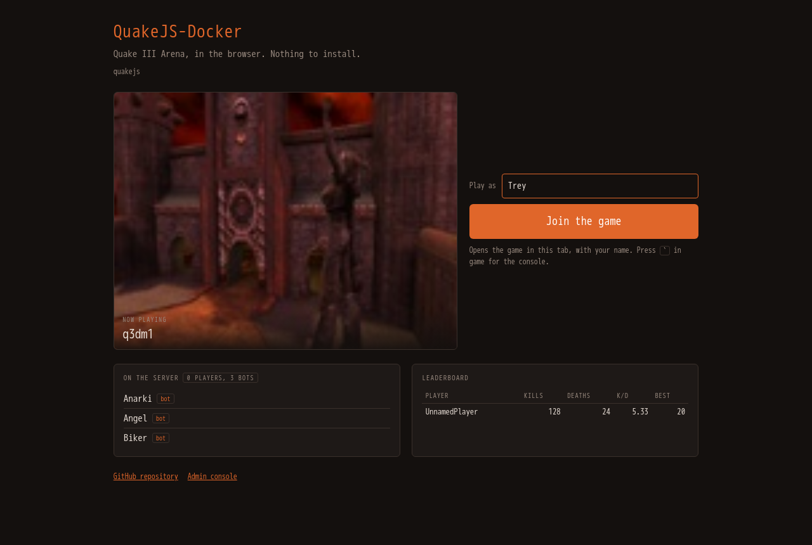
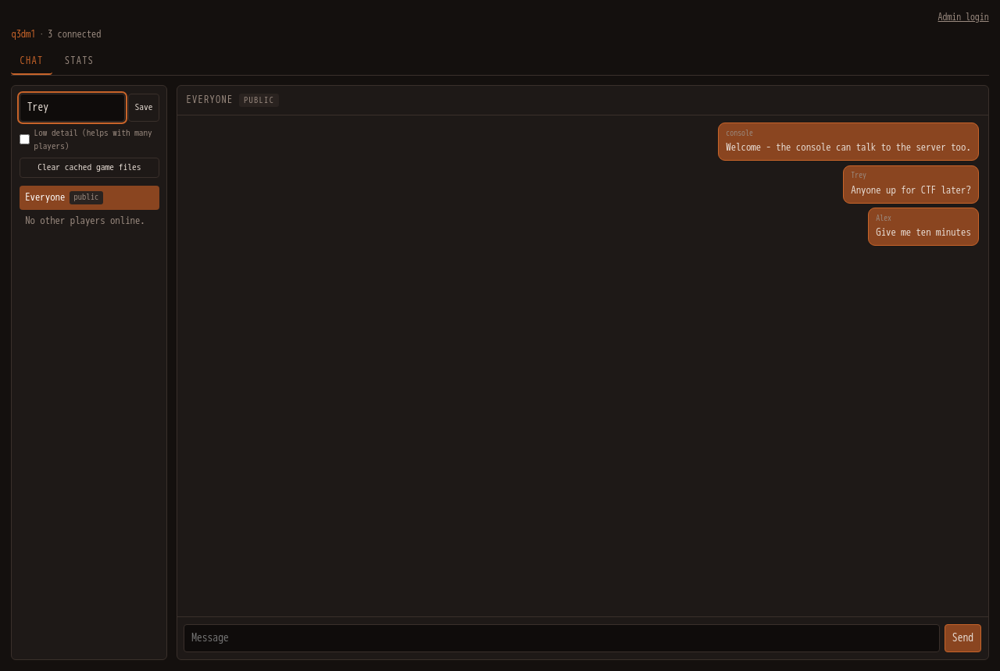
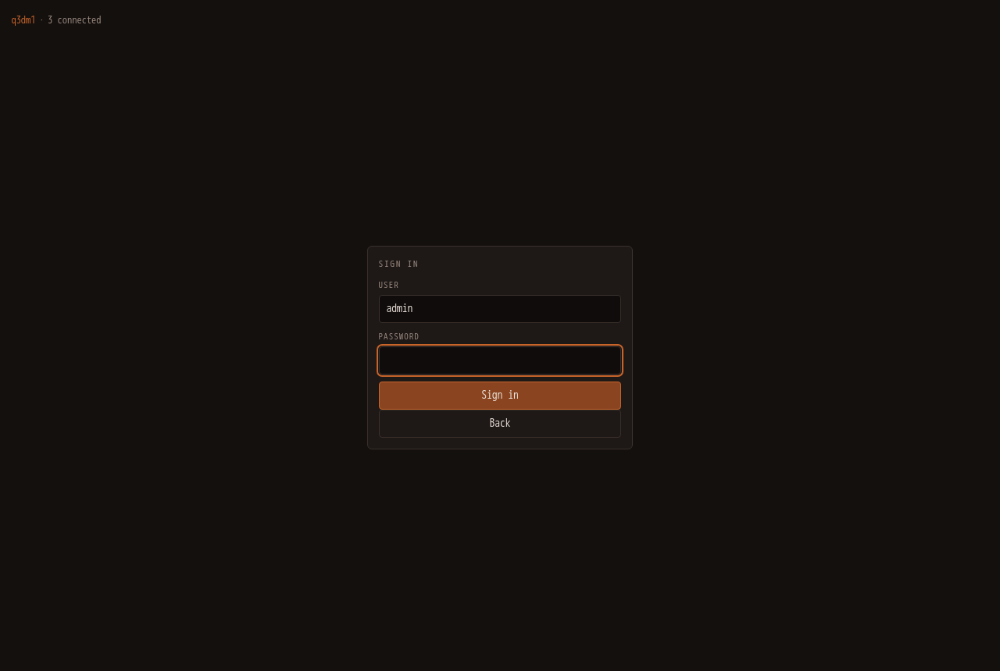
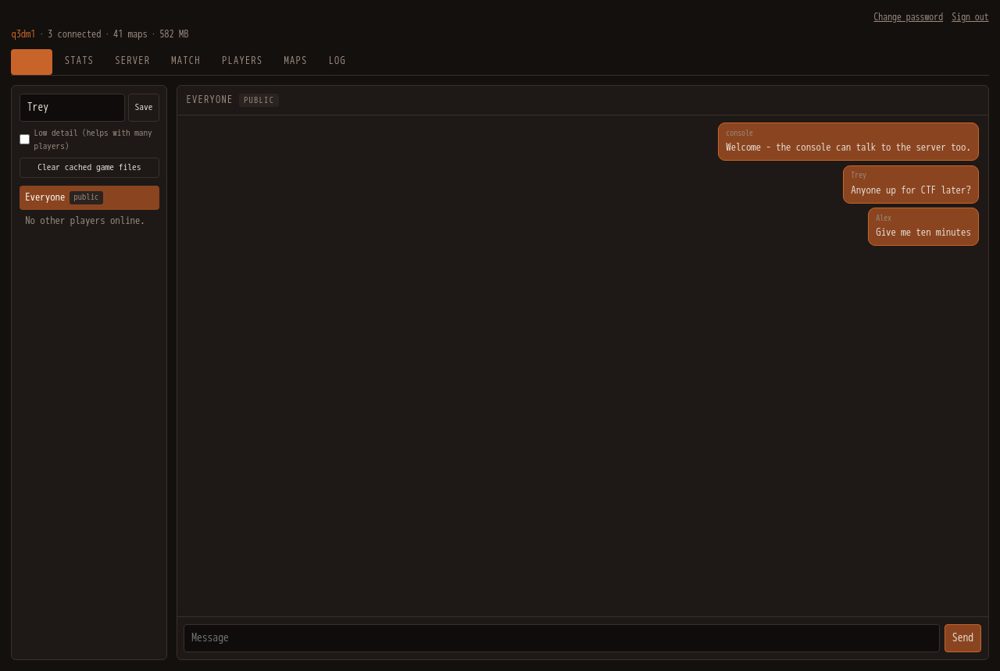
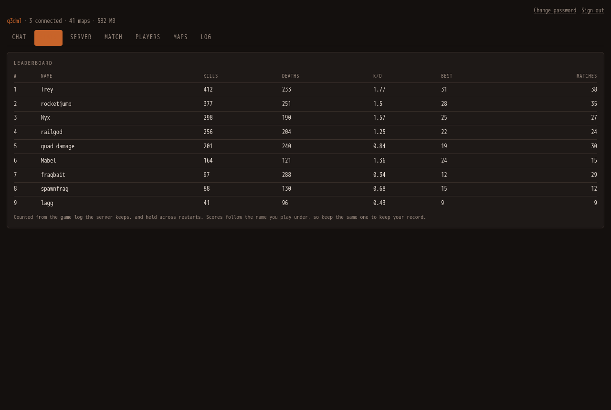
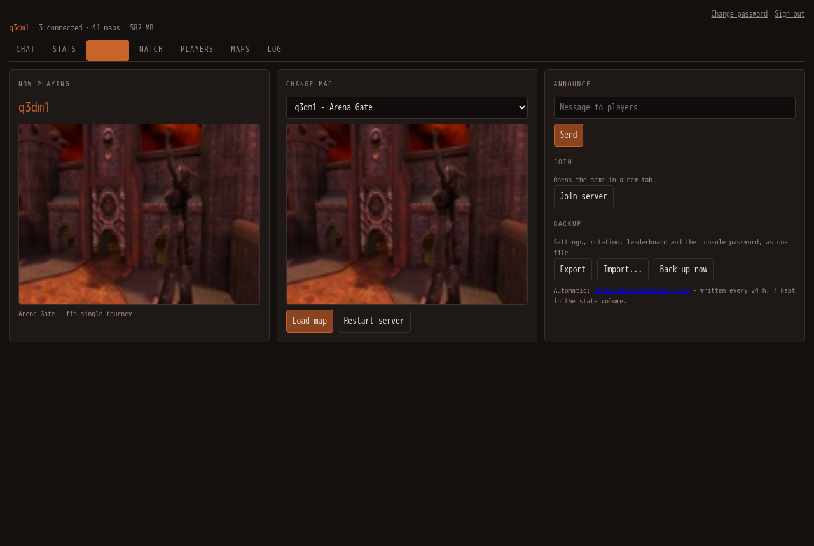
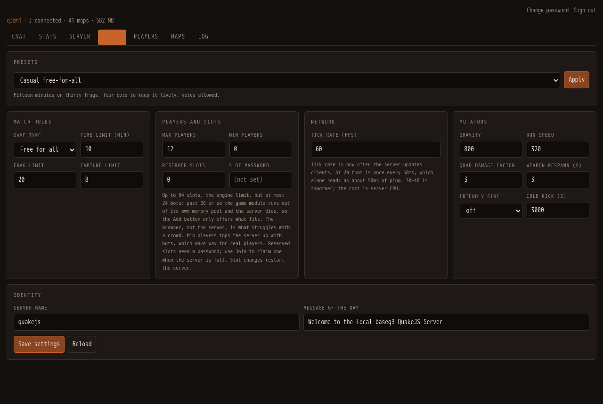
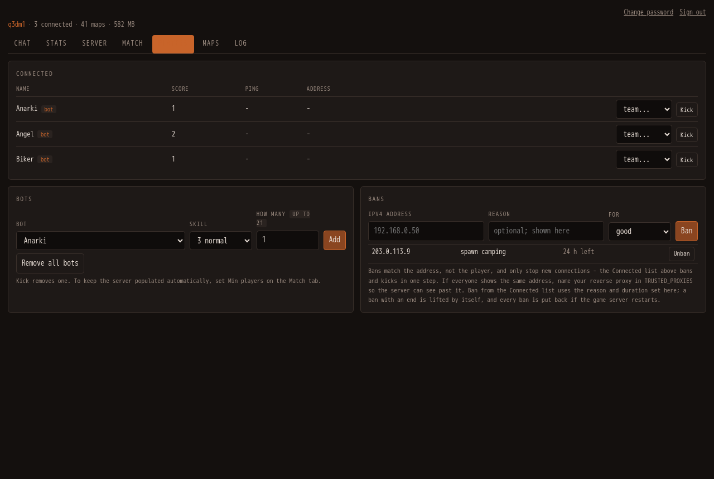
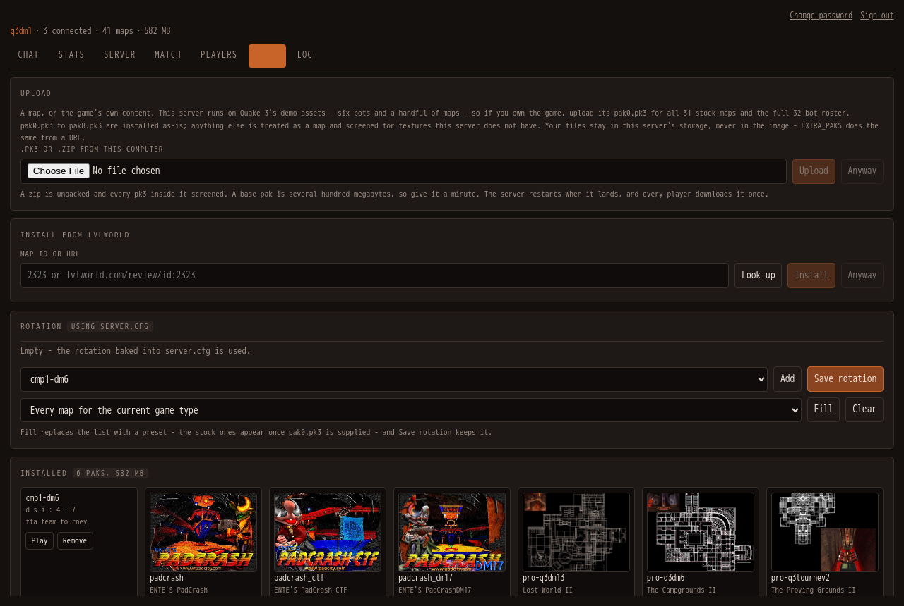
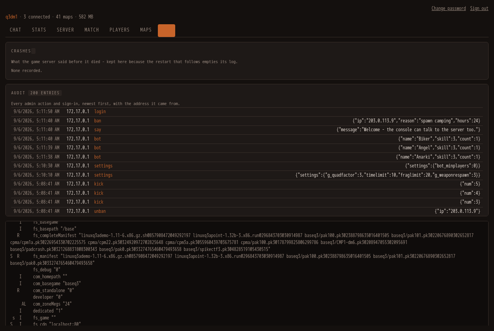

<div align="center">


# [QuakeJS-Docker](https://github.com/treyyoder/quakejs-docker)


</div>

Fully local and Dockerized QuakeJS server. This project bundles assets and server binaries so gameplay does not depend on content.quakejs.com. Source: [github.com/treyyoder/quakejs-docker](https://github.com/treyyoder/quakejs-docker).

## Install

You need Docker (Docker Desktop or the engine) and about a gigabyte of disk for the image. Everything runs on one published port: the page, the game's websocket traffic, the assets and the console all go through it, so one port forward or one reverse-proxy host is all a public server needs.

**With Docker Compose**, from the repository root:

```bash
docker compose up -d
```

**With `docker run`**, from the published image:

```bash
docker run -d --name quakejs -p 8080:80 \
  -v quakejs-assets:/var/www/html/assets \
  -v quakejs-state:/var/lib/quakejs \
  treyyoder/quakejs:latest
```

Then open `http://localhost:8080/`. The front page shows the server and a **Join** button; the console is at `/admin/`.

**First start.** No password is baked into the image. Unless you set `ADMIN_PASSWORD`, the console generates one the first time it starts and prints it once to the container log:

```bash
docker logs quakejs 2>&1 | grep generated
```

Sign in with it under **Admin login**, then change it under **Change password** if you like; it is kept, hashed, in the state volume. To choose your own instead, set `ADMIN_PASSWORD` (in `.env` or the shell for Compose, `-e` for `docker run`). Setting it to an empty string disables the console entirely.

**What persists.** Two volumes: `quakejs-assets` holds the maps and paks you install, `quakejs-state` holds the password, settings, rotation, leaderboard, bans, audit trail, crash notes and automatic backups. Recreating the container keeps all of it; deleting the volumes is the reset. The image runs unprivileged and hands both volumes to its own user at start, so volumes created by an older version keep working.

**Behind a reverse proxy** (nginx-proxy-manager, Caddy, Cloudflare): forward the one port with websockets enabled, name the proxy's address in `TRUSTED_PROXIES` so players' real addresses come through for kicks and bans, and force HTTPS at the proxy so the session cookie never travels in the clear. Details under [Player addresses, kicks and bans](#player-addresses-kicks-and-bans).

**Your Quake 3.** The image ships the demo content only. If you own Quake III Arena, upload your `pak0.pk3` from the console's Maps tab, or point `EXTRA_PAKS` at a URL you control, and the full game appears - all the stock maps, every bot, the retail textures. See [Supplying your own Quake 3 assets](#supplying-your-own-quake-3-assets).

**Updating.** Pull the new image and recreate the container; the volumes carry everything over. Every published image is built for amd64 and arm64 and signed; the [Testing](#testing) section says how to verify one.

**Environment.** `ADMIN_PASSWORD`, `ADMIN_USER`, `TRUSTED_PROXIES`, `NOTIFY_WEBHOOK`, `EXTRA_PAKS`, `FS_GAME`, `Q3_HUNK_MEGS`, `BOT_CEILING`, `Q3_GAME_LOG_MAX`, `Q3_LOG_MAX` - each is explained where its feature is, and [docker-compose.yml](docker-compose.yml) carries the ones you are likely to set.

## User guide

### The front page



`http://<host>:8080/` is the lobby: the server's name, the map that is up with its picture, who is on, the top of the leaderboard, a **Play as** field and **Join the game**. It refreshes itself every ten seconds. The name you type is kept in your browser - the console's Chat tab uses the same one - and every launch of the game applies it, so nobody has to be UnnamedPlayer. Join opens the game in the same tab; the first visit downloads the game data (a couple of hundred megabytes with pak0, much less for the demo) and keeps it in the browser, so later visits are quick.

### The console

Press **`` ` ``** (backquote) in game and the console opens over the game; `` ` `` again, `Esc`, or a click outside closes it. It is also a page of its own at `/admin/`, which is what the pictures below show.



Without signing in, the console is a messenger anyone can use: **Everyone** is the public thread, each connected player is a private one, and the name you give is kept in this browser - it is the name the game launches with, from here or from the front page. **Save** it while the console is open over the game and the game reloads under it; saved from the console's own page, it applies the next time you join. The **Stats** tab is public too.



**Admin login** at the top right asks for the console password (see [Install](#install) for where it comes from) and unlocks the other tabs. Sessions last twelve hours; repeated wrong passwords lock the address out for a minute.

### Chat



The same messenger, now with the whole picture: as admin you also see in-game team chat and private messages between players, which the public view does not. Send to **Everyone** or pick a player for a private message. Bots' chatter never appears here.

### Stats



The leaderboard the front page shows, in full: kills, deaths, suicides, matches, best score and the ratio, for players only - bots are tracked but never listed. It is read from the game's own log, survives restarts, and forgets names not seen for ninety days.

### Server



- **Now playing** - the current map and its picture.
- **Change map** - pick a map (only the ones the current game type supports are listed) and **Load map**; **Restart server** brings the game server back from scratch, which is what a newly installed map needs.
- **Announce** - a line from the server to everyone in game.
- **Join** - opens the game in a new tab; **Low detail** on the Chat tab makes that launch lighter for a crowded server.
- **Backup** - **Export** downloads the settings, rotation, leaderboard and password as one file, **Import** restores one, and the automatic daily backups (seven kept in the state volume) are listed for download. **Back up now** writes one on the spot.

### Match



- **Presets** - one click sets up a casual free-for-all, a duel, team deathmatch, capture the flag or a low-gravity party: game type, limits, bots and mutators together. Then fill the rotation to match on the Maps tab.
- **Match rules** - game type, time / frag / capture limits.
- **Players and slots** - max players, minimum players (the game adds bots to reach it), reserved slots and their password.
- **Network**, **Mutators**, **Identity** - tick rate; gravity, run speed, quad, weapon respawn, friendly fire, idle kick, player votes; server name and message of the day.

Values that only take effect on a map reload or a server restart say so. **Save settings** applies them live where it can and remembers them for the next restart.

### Players



- **Connected** - everyone on the server with the address they came from (`shared` marks an address more than one player uses). Move a player between teams, **Kick**, or **Ban** - which bans the address and kicks in one step.
- **Bots** - choose one, a skill, and how many; the field says how many still fit (free slots, or the game module's limit, whichever is lower). **Remove all bots** does what it says.
- **Bans** - an address, a reason, and a duration from an hour to thirty days or for good. Timed bans lift themselves; every ban is put back if the game server restarts, since the game itself forgets them. **Unban** lifts one now.

### Maps



- **Upload** - a `.pk3`, or a `.zip` holding one, from your computer. This is also where your own `pak0.pk3` (and `pak1`-`pak8` from the 1.32 point release) go if you own Quake 3. A map missing textures this server does not have is refused with a count, unless you insist.
- **Install from ..::LvL** - an lvlworld map id or URL: **Look up** shows what it is, **Install** fetches it, checks it against lvlworld's own checksum, and restarts the server so it is playable. Downloads come from whichever of lvlworld's mirrors hands the file over.
- **Rotation** - the order maps cycle in. Add one at a time, or **Fill** from a preset (every map for the current game type, the stock sets, or everything installed), then **Save rotation**; it takes effect at the next server restart.
- **Installed** - every map on the server with its picture, **Play** to load it now, **Remove** for the ones you installed (the game's own paks cannot be removed from here).

### Log



- **Crashes** - what the game server printed before it died, with the map and the bot count, kept for the last twenty crashes; open one to read the log tail.
- **Audit** - every admin action and sign-in, newest first, with the address it came from. Passwords never appear.
- **The raw log** - the game server's console output, live.

### Things you will do

| I want to… | Do this |
|---|---|
| play the full Quake 3 | Maps → Upload → your `pak0.pk3`; the server restarts with all the stock maps. |
| add a community map | Maps → Install from ..::LvL → paste the id from lvlworld.com → Look up → Install. |
| set up a CTF night | Match → Presets → Capture the flag → Apply; Maps → Rotation → Fill "Stock CTF" → Save; Server → Restart server. |
| fill an empty server | Players → Bots → choose, pick a skill, Add - or Match → Min players, and the game keeps it populated. |
| deal with someone | Players → Connected → Ban (set a reason and a duration under Bans first) - or Kick. |
| move house | Server → Backup → Export; on the new host, Import, then Restart server. |
| find out why it died | Log → Crashes. |
| change the password | Change password, top right. It signs everyone out. |

## Console reference

The [User guide](#user-guide) above says how to use the console; this is how it works and why.

Press **`` ` ``** in game to open the console as a modal, or visit `http://<host>:8080/admin/`. `` ` `` again, `Esc`, or a click outside closes it. **Shift+`** is left alone, so Quake's own console still works.

The console opens in **public mode**, which needs no sign-in. It is a messenger: a contact list on the left, the conversation on the right.

- **Everyone** is the public thread - what you send there goes to the whole server.
- **Each connected player** gets their own private thread.
- **Your name** is kept in this browser, so it is still there days later. Save it over the game and the game reloads under it.
- Unread counts appear next to a contact while you are reading another thread.

Threads are built from two sources, because the server logs only half of a conversation: messages sent from the console are recorded as they go out, and player chat is read from the server log. That has one consequence worth knowing - a console user is not a connected client, so a player has no way to address a private reply back to a browser. Their replies land in **Everyone**. If your display name matches a name you are playing under, private replies to that name reach you in game.

Public chat is throttled per browser and overall, and every value is stripped of characters that mean something to the server command parser. Names are self-declared: they are labels, not identities the server vouches for, and anyone who can reach the page can post. If that is not acceptable, set `ADMIN_PASSWORD` to an empty value, which disables the console entirely.

**Admin login** unlocks the rest.

### The front page

`http://<host>:8080/` is a lobby rather than a black screen: the server's name, the current map with its picture, who is on, the leaderboard, and a Join button. It reads the console's public endpoints, so with the console disabled it shows the name and the button and nothing else. The game itself is `/play.html`; the in-game console key and everything else are unchanged.

### Admin mode

The container serves a console for switching maps, adding bots, and installing maps from [..::LvL](https://lvlworld.com). It shares the game's port: open `http://<host>:8080/admin/`, or press **`` ` ``** in game to bring it up as a modal over the running client. `` ` `` again, `Esc`, or a click outside closes it. **Shift+`** is left alone, so Quake's own console still works.

The console has its own sign-in form - there is no browser password dialog. Sign in as `admin` (override the name with `ADMIN_USER`). **No password is baked into the image.** Leave `ADMIN_PASSWORD` unset and the console generates one on its first start, stores it hashed in the state volume, and prints it once to the container log:

```bash
docker logs quakejs 2>&1 | grep generated
```

It is never shown again, so either keep that line or change it under **Change password**. Set `ADMIN_PASSWORD` to choose your own, or to an empty string to disable the console entirely.

**However it is set, treat it as the root password of the server.** The console has full control of the game server: it changes maps, kicks players, and downloads and installs files from the internet onto the host. To choose the password yourself, set it in your deployment (the shell or `.env` for [docker-compose.yml](docker-compose.yml)), never in the image:

```bash
docker run -d --name quakejs -e ADMIN_PASSWORD=something-long -p 8080:80 treyyoder/quakejs:latest
```

You can also change the password from inside the console, under **Change password**. It is stored as a salted PBKDF2 hash at `ADMIN_STATE` (default `/var/lib/quakejs/admin.json`), deliberately outside the web root so it is never served. Mount a volume there to keep it across redeploys, as the compose file does; without one, recreating the container generates a new password (or falls back to `ADMIN_PASSWORD` when that is set). A stored password - generated or chosen in the console - takes precedence over the environment variable, and the log says so at start. To fall back to `ADMIN_PASSWORD`, or to have a fresh one generated, delete that file and restart the container.

Changing the password signs out every session. Repeated failed sign-ins from one address are locked out for a minute - and that address is the player's own, read out of `X-Forwarded-For` the same way the game server does (so `TRUSTED_PROXIES` matters here too), never the proxy's. Scripted `Authorization: Basic` counts against the same lockout.

Behind a TLS-terminating proxy the session cookie is marked `Secure`, so it is never sent back over plain HTTP. That only helps if the proxy **forces** HTTPS; with SSL merely available, a visitor who types `http://` gets an unprotected cookie. Force it.

Every response says what it is (`X-Content-Type-Options: nosniff`) and may only be framed by this site (`frame-ancestors 'self'` - the in-game overlay frames the console from the game page). The console page carries a strict Content-Security-Policy - nothing from anywhere else, and nothing inline, script or style; the game page does not, because the emscripten client is not something to restrict blind. Neither Apache nor the console announces a version. A Discord or Slack webhook can never turn a player's name into a mention, and a map upload, an inner pk3, or an `EXTRA_PAKS` download is refused past its size limit before it is read or inflated.

Nothing in the running container is root. The entrypoint starts as root only to hand the two volumes and the game directory to the `quake` user - a volume created by an older version of this image may still be root-owned - and then replaces itself with an unprivileged copy; Apache (which binds port 80 through a file capability), the game server, the console and the supervisor all run as `quake`. You can also start it with `--user quake` (uid 1000); then nothing is handed over, and a volume that is not writable stops the container with the one-line fix printed in the log.

Every admin action and every sign-in is recorded with the address it came from - under **Log**, and as `[audit]` lines in the container log. Passwords never appear; a secret setting appears by name. Anonymous reads of the public chat, roster and leaderboard are limited per address as chat is, so a loop cannot keep the console busy; a signed-in admin's own polling is not counted.

Chat is public; private messages are not. Anyone can read the public stream, and a browser sees the private messages it sent itself. In-game `tell` and team chat pass between players who did not agree to publish them, so they reach admins only.

Setting `ADMIN_PASSWORD` to an empty value disables the console entirely; `/admin/` then returns 503 and the in-game modal stays inert.

**Backups.** Under **Server**, **Export** downloads one JSON file holding the settings, the map rotation, the leaderboard and the console password (as its salted hash); **Import** restores one, validating every value the way the console does on the way in. Settings and rotation take effect on the next server restart; the leaderboard at once; a restored password signs everyone out. The same bundle is at `/api/export` and `/api/import` for scripts.

**Logs.** Apache writes to the container's own output, so `docker logs` has it and Docker's log rotation (`--log-opt max-size`, or the daemon default) bounds it. The engine's `games.log` is rotated at the next server start once it passes `Q3_GAME_LOG_MAX` (50 MB; one previous copy kept), and the console log is emptied in place past `Q3_LOG_MAX` (20 MB). The leaderboard and audit files are capped by their own rules.

**Health.** The container is healthy when the page serves, the game port listens, the engine has not reported a crash, and the console answers (unless it is disabled). A console that dies is restarted by the entrypoint, the same as the game server.

Passwords stored by the console use PBKDF2-HMAC-SHA256 at 600,000 rounds; a hash made with fewer, by an older version, still signs in and is re-hashed the first time it does.

The console is organised in tabs:

- **Server** - current map with its levelshot, switch maps (filtered to the ones the active gametype supports), restart, broadcast a message to players, and a Join button that opens the game in a new tab. Backup here: Export, Import, and Back up now, with the automatic daily backups (seven kept in the state volume) listed for download.
- **Match** - gametype, time/frag/capture limits, player slots, mutators (gravity, run speed, quad factor, weapon respawn, friendly fire, idle kick), and the server name and MOTD. Values that only take effect on a reload or restart say so before you save. Presets apply a whole setup in one click - casual free-for-all, duel, team deathmatch, capture the flag, party - through the same validation as the form.
- **Players** - who is connected with the address they came from, kick, move between teams, and ban. Banning from this tab bans the address and kicks the player in one step, and warns first if anyone else shares that address. Bots can be added as many at a time as fit: the free client slots (raise Max players on the Match tab for more), or the game module's own ceiling of 24 - its allocator gives out at 26-27 bots, measured, and past that it takes the server down; `BOT_CEILING` overrides it for a mod with more room. The How many field shows the number. A ban takes a reason and an optional duration (an hour to thirty days); a timed ban lifts itself, and every ban is put back when the game server restarts, since the game itself forgets them.
- **Maps** - installs from ..::LvL come through whichever of the mirrors its download page offers hands the file over: lvlworld's own host has taken to refusing downloads with a 403 (browsers included), the FSS mirror serves the same file, and the sha256 the page publishes is checked either way. A host that refused is tried last for a while. Presets fill the rotation in one click (every map for the current game type, the stock deathmatch, tourney or CTF sets once pak0.pk3 is supplied, or everything installed); every installed map as a thumbnail with its long name and supported gametypes, install from ..::LvL by id or URL, upload a `.pk3` (or a `.zip` holding one) straight from your machine, remove maps you installed, and edit the map rotation. Uploads are screened for missing textures exactly like ..::LvL installs, and **Anyway** overrides that. Treat the count as a smell rather than a verdict - Quake 3's own maps reference up to five shaders that ship in no pak, and render fine, so only a large number means a map was built against textures this server does not have.
- **Log** - live server output, following the tail unless you scroll up. Crashes are kept here too: the last two hundred lines the game server printed before it died, with the map and the bot count, twenty deep - the restart that follows would otherwise have emptied the log.
- **Stats** - the leaderboard. Public, like Chat, so players can see it without a password.

Only maps from the running mod (`FS_GAME`, default `baseq3`) are offered, since loading one from another game directory crashes the server. Maps that ship in the image cannot be removed, and neither can a base pak somebody supplied - removing it would take every map and bot it provides. Bots come from what the bundle actually defines, which for the demo content is six, not the full retail roster - see [Supplying your own Quake 3 assets](#supplying-your-own-quake-3-assets). Maps whose preview is a `.tga` show no thumbnail, because browsers cannot display that format.

### Player addresses, kicks and bans

Players reach the game through the Apache proxy inside the container, so without help the game server sees every one of them as `127.0.0.1` - one address for the whole server, which makes a ban either useless or catastrophic. The bundled server reads the real address out of `X-Forwarded-For` instead.

It only believes that header on a connection from loopback, which means the container's own Apache, and it reads the entry from the **right**, since that is the one a proxy of ours appended rather than something the client wrote. A client can send whatever `X-Forwarded-For` it likes and be ignored.

If you run another reverse proxy in front - nginx-proxy-manager, Cloudflare, a load balancer - name it in `TRUSTED_PROXIES` so its own hop is skipped too:

```bash
TRUSTED_PROXIES="172.16.0.0/12"        # the docker networks your proxy sits on
TRUSTED_PROXIES="10.0.0.5, 10.0.0.6"   # or the proxies themselves
```

Leave it empty when the container is reached directly. Get it wrong and bans stop being useful again, but nothing opens up: an unlisted hop is simply not trusted. The Players tab shows each player's address and marks any that more than one player shares, so a ban that would catch bystanders says so before you confirm it.

IPv6 clients still fall back to the proxy address, because Quake 3 bans are IPv4.

### Leaderboard

The **Stats** tab ranks players by kills, with deaths, K/D, best round and matches played. It is built by following the match log the game engine writes, so it counts what actually happened rather than what the console saw, and bots are listed separately - the engine marks them in their userinfo, so they cannot be confused with a player using a bot's name.

Records are kept per name in `/var/lib/quakejs/stats.json` and survive restarts, so mount a volume there to keep them. Names are self-declared, so treat the board as a scoreboard rather than a record of identities.

### Telling yourself the server is busy

Set `NOTIFY_WEBHOOK` to a Discord or Slack incoming webhook and the console posts once when a real player joins a server that had nobody on it. Bots never trigger it, a map change does not count as arriving, and `NOTIFY_COOLDOWN` (default 900 seconds) caps how often it can fire. Unset, nothing is sent anywhere.

### Player votes

**Allow player votes** on the Match tab turns on `g_allowVote`, which lets players call their own map and kick votes from the in-game menu instead of asking an admin.

### Getting in when the server is full

Set **Reserved slots** to 1 or more and give it a password on the Match tab. Those slots are held back from ordinary players, and the **Join** button hands the password to the game through the query string so you always get in. `bot_minplayers` keeps the server populated with bots that make way for real players.

### Settings that outlive a restart

Anything changed on the Match tab, plus the rotation, is written to the state directory as JSON and folded into the config the server reads on every start, so it survives restarts and redeploys. Mount a volume at `/var/lib/quakejs` (as [docker-compose.yml](docker-compose.yml) does) or these revert when the container is recreated.

Installed maps are written to the served asset directory. Mount a volume there (as [docker-compose.yml](docker-compose.yml) does) to keep them across redeploys; bundled assets are re-synced from the image on every start, so updates you ship in the repo still land.

## Supplying your own Quake 3 assets

The image ships the bundle QuakeJS itself ships: Quake 3's **demo** content, the 1.32 point release, and the two paks QuakeJS adds to fill retail gaps. That is what makes the server playable out of the box, and removing any of it breaks the browser client - the point release in particular carries the 2002 game module, and `addip` and the rest of the game-side commands live there rather than in the engine.

It is not all freely redistributable. `pak100.pk3` holds 121 files byte-identical to retail `pak0.pk3`, and the point release is id's own patch. If you publish an image built from this, that is yours to weigh.

What is *not* here is retail `pak0.pk3`, and that is the file that matters most: it holds all 31 stock maps, all 32 bots, and the textures custom maps expect. If you own the game, supply your own copy - it lands in the server's storage, never in the image.

| you supply | you get |
|---|---|
| nothing | 4 stock maps and the `pro-*` maps, 6 bots, the bundled community maps |
| `pak0.pk3` | all 31 stock maps, all 32 bots, and every bundled map rendering as its author intended |

Prepare a copy first:

```bash
python tools/add-retail.py "C:/Program Files (x86)/Steam/steamapps/common/Quake 3 Arena/baseq3"
```

It checks the file is genuinely retail, trims it (see below), writes it to `dist/pak0.pk3`, and prints its SHA-256. `dist/` is gitignored and dockerignored. Then get it to the server either way round.

**Upload it** - console, Maps tab, **Upload**. Pick the file and it goes up with a progress readout, lands in the asset volume, and the server restarts to pick it up. That one control takes maps and game content both: `pak0.pk3` - `pak8.pk3` are installed as-is, and anything else is treated as a map and screened for textures this server does not have.

**Or link it** - put the file anywhere the container can reach over HTTP and name it in `EXTRA_PAKS`:

```bash
EXTRA_PAKS="https://your.host/pak0.pk3#sha256=e84164b3..."
```

It is fetched on start into the asset volume, so it downloads once and is reused. The `#sha256=` part is optional but worth setting: without it an already-present file is left alone, and with it a file that no longer matches is fetched again. An entry can also be written `name.pk3=https://...` when the URL does not end in the filename you want, and several entries can be given separated by whitespace. A pak that fails to arrive is logged and skipped rather than being fatal.

Either route puts the file in the volume rather than the image, so it survives redeploys and never reaches a registry.

### If the game will not finish loading

The client keeps every pak it has downloaded in a browser store, and re-downloads any whose checksum no longer matches what the server offers. Change a server's assets and returning players hit that: if the replacement cannot complete, the client restarts from the top and the loading screen loops. It loops far too fast to clear storage by hand.

The way out is the console, because it is the same origin but never opens that store. Open `http://<host>:8080/admin/` **in its own tab** - not the in-game overlay, which is part of the game page - and use **Clear cached game files** in the Chat sidebar. Close any tab running the game first, or the store stays locked and the button says so.

### Why the music and cinematics are dropped

`add-retail.py` leaves out `music/` and `video/` by default, and that is not a size preference - the browser client cannot load the whole file. It downloads every base pak before the game starts and holds them in memory, and emscripten's MEMFS turns a file's bytes into a plain JS array, one element per byte, whenever the file is resized. Retail `pak0.pk3` is 479,493,658 bytes, so that array needs several gigabytes and the load dies with `RangeError: Invalid array length`.

Those 29 files are 62% of the pak and a browser deathmatch server never plays them, so dropping them takes `pak0.pk3` from 457 MB to 178 MB, with every map, model, texture, bot and gameplay sound intact. The cost is no in-game music and no id logo movie. Pass `--full` to keep them if you only care about the dedicated server; the browser client will not load the result.

### What had to be patched to make this work

[tools/patch-quakejs.py](tools/patch-quakejs.py) applies two fixes at build time, to both the server and the browser client.

The first is the installer list. Both bootstrap their base paks from a hardcoded set of self-extracting archives, and the demo installer's only job is to produce `baseq3/pak0.pk3`, checked against the demo file's checksum. Left alone it would write the demo pak over a supplied retail one on every start. An installer whose paks the manifest already carries is now skipped, and one the manifest does not list at all is skipped rather than treated as an error.

The second is overwriting a large pak. MEMFS converts a file to a plain JS array on any resize, and `writeFile` truncates to zero before every write, so replacing a 178 MB pak built a 186-million-element array purely to discard it and threw `RangeError`. Truncating to zero now just drops the contents. Without this the first write of a pak succeeds and every later one fails, so changing a server's assets breaks it for every returning player until they clear their browser storage.

## Testing

[tools/smoke-test.sh](tools/smoke-test.sh) starts the built image and checks the things that have broken before - the websocket tunnel, client asset origins, custom maps loading through the manifest, bundled-map textures, console auth, map uploads, and that a player's address survives the proxy without the client being able to forge it. CI runs it and will not push an image that fails.

```bash
docker build -t quakejs:ci . && tools/smoke-test.sh quakejs:ci
```

The address logic also has unit tests that need no container:

```bash
node tools/test-client-address.js
```

The image is built for amd64 and arm64 from a base pinned by digest and a node tarball pinned per architecture, and every image CI pushes is signed keyless with cosign; verify one with `cosign verify treyyoder/quakejs:latest --certificate-identity-regexp 'https://github.com/treyyoder/quakejs-docker/' --certificate-oidc-issuer https://token.actions.githubusercontent.com`. Each push is also tagged with its commit, so a deployment can pin exactly what it runs.

The console's pure parts - the status, chat and game-log parsers, the settings spec, the log follower, client attribution through the proxy, and `build-config.py` end to end - have unit tests that run on the host, at image build (a failure stops the build), and again inside the built image from the smoke suite:

```bash
python3 tools/test-admin.py
```

The console itself is a small package, [admin/qadmin/](admin/qadmin/), with one module per concern (its docstring is the map); [admin/server.py](admin/server.py) is the entry point, and the page is [admin/index.html](admin/index.html) with its styles and script beside it. Every endpoint is one function in `routes.py`, registered with whether it is public; `web.py` refuses a request that needs a session before reading a byte of its body.

## Configuration

- The public port carries everything: the page, the game assets, and the game itself. The client adapts to whatever origin the browser used (any host, any port, HTTP or HTTPS), and Apache inside the container proxies websocket upgrades to the internal game server on 27960, so the game works behind a TLS-terminating reverse proxy over `wss://`.
- The `HTTP_PORT` environment variable from older versions is gone; no configuration is needed for the page to find its server.
- Main game settings live in [server.cfg](server.cfg).
- `TRUSTED_PROXIES` - reverse proxies in front of this container, so players' real addresses survive the trip and bans land on the right person. See [Player addresses, kicks and bans](#player-addresses-kicks-and-bans).
- `NOTIFY_WEBHOOK` / `NOTIFY_COOLDOWN` - optional Discord or Slack ping when somebody starts playing on an empty server.
- `EXTRA_PAKS` - paks to fetch at start instead of shipping, for licensed game content the image must not carry. See [Supplying your own Quake 3 assets](#supplying-your-own-quake-3-assets).
- Remote administration is disabled by default. Set a strong `rconpassword` in [server.cfg](server.cfg) before enabling it.
- See Quake 3 server variable reference at https://www.quake3world.com/q3guide/servers.html.

## Non-Docker Testing

You can run this project without Docker by reproducing the container steps:

1. Clone https://github.com/begleysm/quakejs and run npm install.
2. Copy [server.cfg](server.cfg) into both quakejs/base/baseq3/server.cfg and quakejs/base/cpma/server.cfg.
3. Copy [include/ioq3ded/ioq3ded.fixed.js](include/ioq3ded/ioq3ded.fixed.js) to quakejs/build/ioq3ded.js.
4. Copy [include/assets](include/assets) into quakejs/html/assets.
5. Update quakejs/html/index.html host/port in the same way [entrypoint.sh](entrypoint.sh) does.
6. Serve quakejs/html on your desired HTTP port and run:

```bash
node build/ioq3ded.js +set fs_cdn localhost:8080 +set fs_game baseq3 +set dedicated 1 +exec server.cfg
```

## Notes

- This repo targets current Docker Compose syntax (no compose file version key).
- The image is built from pinned inputs: a specific quakejs commit (`QUAKEJS_REF`) and an exact Node release verified against the sha256 nodejs.org publishes (`NODE_VERSION`, `NODE_SHA256`). Nothing upstream changes the image until those are bumped on purpose.
- The game server listens on TCP 27960 inside the container (QuakeJS clients connect over WebSockets), but browser traffic reaches it through the published HTTP port via Apache's websocket proxy. Publish `-p 27960:27960` additionally only if something needs to hit the game socket directly.

## Credits

Thanks to begleysm and their QuakeJS fork/documentation:

- https://github.com/begleysm/quakejs
- https://steamforge.net/wiki/index.php/How_to_setup_a_local_QuakeJS_server_under_Debian_9_or_Debian_10
